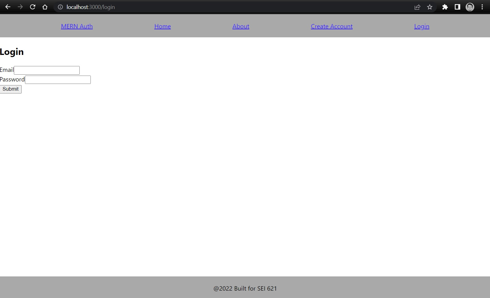
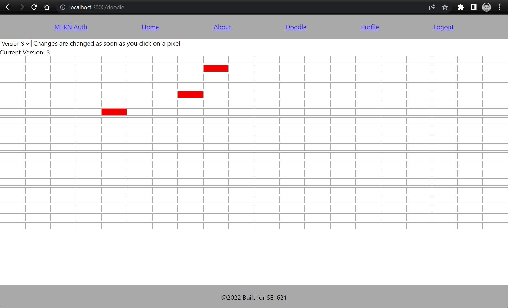
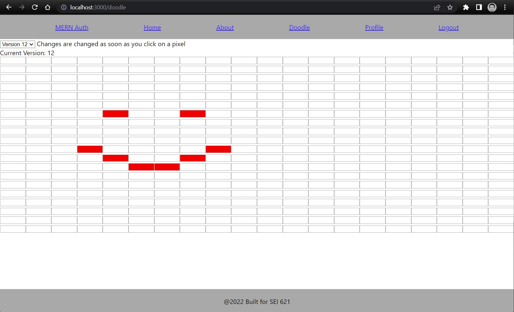

# Doodle history app

This is a simple web app that allows a user to log into the site with an email and password and then draw a piece 20x20 of pixel art. 

This app will save each new pixel added to the drawing and will allow the user to rewind their drawing, as in, visit the state of the drawing for each pixel placed. This drawing will be stored in mongoDB via our backend application with an association to our user that we used to log in with. 

The goals of the project are to challenge you to implement some more complex mongoDB models, as well as some more complex and algorithmically rigorous frontend data manipulation logic. We also hope to reinforce the fundamentals of MERN stack by building off the same template we used for project 3 and by providing you an excuse to get some additional MERN stack reps in. 

## Authentication

We'll be using the Authentication boiler plate form project 3, and will be using the user created to associate our drawing to. 

We will be using a JWT for our authentication(like in project 3) please review the postman collections in the backend project to see how we're storing our token in postman and how we're passing that token to our API.

Feel free to style this page in a way that you feel is challenging you and your CSS skills. 



## Draw page(baseURL/doodles)

The guts of our application will be inside of the doodle Page. You will click on each cell on the draw page to add a red pixel, this change will be passed to the backend and will be stored for your user in mongodb. You can also see on the top left corner of the page, there is a version dropdown(should be between 0-n), this will allow you to rewind your actions used to draw your pixel art. 



this image is of our 3rd pixel edit.

When we click on new cells we will create a new version, if we click on a red cell it will be updated to white, and when we click on a white cell it will be updated in a new version with a red cell. 

See how when we draw a smiley face, we will have added 9 additional versions for the individual pixel updates. 



# Setup

This project is built off of your starter templates for MERN stack that you used for project 3.

## install node packages

```
npm i
```

this should install the following packages

```
    "bcrypt": "^5.1.0",
    "cors": "^2.8.5",
    "dotenv": "^16.0.3",
    "express": "^4.18.2",
    "jsonwebtoken": "^8.5.1",
    "mongoose": "^6.7.2",
    "passport": "^0.6.0",
    "passport-jwt": "^4.0.0"
```

feel free to install any additional packages you may want to include.

## Mongodb

ensure that you have mongodb running locally or that you have a working mongo atlas URI added to your .env file.

your .env file should look something like this

```
PORT=5000
MONGO_CONNECTION_STRING=<mongo connection string>/doodle-history-app
JWT_SECRET=<some random string>
```

This collection will be used for the doodle-history-app, feel free to name your database whatever you please, but i've named mine 'doodle-history-app'. 

## Postman

inside of this backend project is a postman collection with your signup and login routes already created with a postman environment file setup for these endpoints. Please see the postman login route to see how we are saving authentication tokens in your postman environment. (this is so you do not have to copy and paste your jwt from your login route to other postman request)

## Debugging

Please note there is launch.json file already created to locally debug this backend project inside of the .vscode directory. 

# Steps

We will have to create the following controllers and models to support our doodle app's frontend. 

1. We will need a model that will store doodles for each user
2. we'll need to create our controller for doodles
3. we'll need to create an endpoint for creating doodle version
4. we'll need to create an endpoint for fetching our doodle history
5. we'll need to create a component for deleting drawings

## 1: Creating the models

Our model should hold a reference to a user, and also it should hold a 2 dimension array that contains each cell of our doodle

1. model should have user reference
    This should involve creating a reference association with the user schema in your doodle model
2. model should have doodle array data
    Doodle data will be a collection of doodleData models. We will wantour doodle data to be a 20x20 grid with x and y coordinates for each pixel and an indication on if we need to fill that pixel with color ot now. 

    You may noticed, we really only need to be storying pixels that will be drawn, as our client side app can assume all missing pixels will not be colored in. 

    We will also need to be able to be able to fetch versions of each drawing(each new pixel colored in by our user will be a new doodle version).

    So we will need our doodle model to hold an array of doodle versions, and each doodle version will need to hold the pixel coordinates that should be colored in. 

    ex: 0 = no color, and 1 = color
    see an example of how versions might be stored in our doodle data versions

    ### Version 1
    ```
    0 0 0 1 0 0 0
    0 0 1 0 1 0 0
    0 1 0 0 0 1 0
    1 0 0 0 0 0 1
    0 1 0 0 0 1 0
    0 0 1 0 1 0 0
    0 0 0 1 0 0 0
    ```

    ### Version 2 (change inside of [])
    ```
    0 0 0[0]0 0 0
    0 0 1 0 1 0 0
    0 1 0 0 0 1 0
    1 0 0 0 0 0 1
    0 1 0 0 0 1 0
    0 0 1 0 1 0 0
    0 0 0 1 0 0 0
    ```

    ### Version 3 (change inside of [])
    ```
    0 0 0 0 0 0 0
    0 0[0]0 1 0 0
    0 1 0 0 0 1 0
    1 0 0 0 0 0 1
    0 1 0 0 0 1 0
    0 0 1 0 1 0 0
    0 0 0 1 0 0 0
    ```

## Model suggestions

I'd recommend breaking your doodles up into at least two models, one for holding user association and a collection of doodle versions. I'd also recommend making a doodle version collection that holds your doodle data and maybe even create a pixel schema to fill your doodle data schema with. 

I solved my model issues on the backend with the following two models. 

EX: Doodle collection
```javascript
const mongoose = require('mongoose');
const { Schema } = mongoose;

const doodleSchema = new Schema({
    user: {
        type: mongoose.Schema.Types.ObjectId,
        ref: 'User'
    },
    doodleVersion: [{
        type: mongoose.Schema.Types.ObjectId,
        ref: 'DoodleVersion'
    }]
})

const Doodle = mongoose.model('Doodle', doodleSchema);

module.exports = Doodle;
```

notice how we make an association by reference for doodle version and user.

EX: Doodle version
```javascript
const mongoose = require('mongoose');
const { Schema } = mongoose;
const DoodleDataSchema = require('./doodleData');


const doodleVersionSchema = new Schema({
    version: {
        type: Number,
        required: true,
        min: 0,
        validate : {
            validator : Number.isInteger,
            message   : 'Version: {VALUE} is not an integer value'
        }
    },
    doodleData: [DoodleDataSchema]
})

const DoodleVersion = mongoose.model('DoodleVersion', doodleVersionSchema);

module.exports = DoodleVersion;
```

and our doodle data example model

EX: doodle data
```javascript
const mongoose = require('mongoose');
const { Schema } = mongoose;

const doodleDataSchema = new Schema({
    x: {
        type: Number,
        required: true,
        min: 0,
        max: 19,
        validate : {
            validator : Number.isInteger,
            message   : 'X: {VALUE} is not an integer value'
        }
    },
    y: {
        type: Number,
        required: true,
        min: 0,
        max: 19,
        validate : {
            validator : Number.isInteger,
            message   : 'Y: {VALUE} is not an integer value'
        }
    },
})

module.exports = doodleDataSchema;
```

notice how doodle data is just a schema and not a model, this is because we use an embedded reference in data version for holding a collection of doodle data. 

You can see we have our suggested data model broke up into three main parts. 

1. Doodle collection: This holds a reference to a doodle and all its versions and a user, this is how we search for doodles by users.

2. Doodle versions, these are meant to store each individual state of our doodle after each pixel is edited, every new pixel will create a new version and add it to your doodle collection. 

3. Doodle data schema, is a schema we use to hold a board state. This means it will hold all pixels that should be red, this might only be one pixel, or it could be 100 pixels, the thing to note is doodle data is a record of each pixel inside of a version.

## Doodle controller

In our doodle controller we'll want at least two endpoints, one for getting doodle data, and one for updating a doodle with a new doodle version. So you're looking at at least a GET and a POST route. Here is how we solved for this controller in the solution branch, but challenge yourself to figure out your own way. 

```javascript
// Imports
require('dotenv').config();
const express = require('express');
const router = express.Router();
const bcrypt = require('bcrypt');
const jwt = require('jsonwebtoken');
const passport = require('passport');
const { JWT_SECRET } = process.env;

// DB Models
const User = require('../models/user');
const Doodle = require('../models/doodle');
const DoodleVersion = require('../models/doodleVersion');

router.get('/', passport.authenticate('jwt', { session: false }), async (req, res) => {
    try {
        if (!req.user) throw new Error('No user in session');
        const doodle = await Doodle.findOne({user: req.user._id}).populate('doodleVersion');
        if (!doodle) {
            res.json({
                doodleHistory: null
            })
        } else {
            res.json({
                doodleHistory: doodle
            })
        }
    } catch (error) {
        console.log(`Error in fetching ${req.user.name}'s Doodle`);
        res.status(400).json({
            error: 'Failed to fetch user Doodle'
        })
    }
})

router.post('/update', passport.authenticate('jwt', { session: false }), async (req, res) => {
    try {
        if (!req.user) throw new Error('No user in session');
        // find our existing doodle
        let doodle = await Doodle.findOne({user: req.user._id}).populate('doodleVersion');
        if (!doodle) {
            // if doodle isn't found, we'll create a new doodle
            const initialDoodleVersion = await DoodleVersion.create({
                version: 0,
                doodleData: []
            })
            doodle = await Doodle.create({
                user: req.user,
                doodleVersion: [initialDoodleVersion]
            })
        }

        const { doodleCoords, version } = req.body;
        if (!doodleCoords) throw new Error('No new doodle coordinates passed in request');
        const newDoodleData = doodleCoords.map((coords) => {
            return {
                x: parseInt(coords.xCoord),
                y: parseInt(coords.yCoord)
            }
        })
        const newDoodleVersion = await DoodleVersion.create({
            version: parseInt(version),
            doodleData:  newDoodleData
        });
        doodle.doodleVersion.push(newDoodleVersion);
        await doodle.save();
        res.json({
            doodleHistory: doodle
        })
    } catch (error) {
        console.log(`Error in fetching ${req.user.name}'s Doodle`);
        res.status(400).json({
            error: 'Failed to fetch user Doodle'
        })
    }
})


// Exports
module.exports = router;
```

I'd encourage anyone who is stuck to fire up the solution project and set break points throughout the backend and test our these endpoints using the postman collection included in this project.
